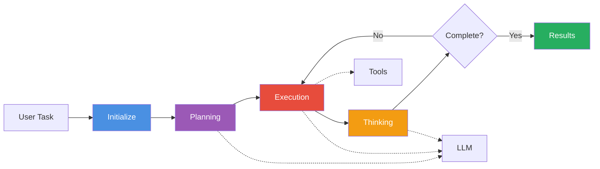

# Open Cursor Agent

[](https://github.com/kyegomez/swarms)
[](https://docs.swarms.world)

An open-source autonomous AI agent implementation inspired by Cursor Agent, built on top of **[Swarms](https://github.com/kyegomez/swarms)** - the enterprise-grade production-ready multi-agent orchestration framework. This production-grade agent can autonomously plan, execute, and complete complex tasks using a combination of Large Language Model reasoning and tool execution.

> **Built with Swarms Framework** - Leveraging the power of [Swarms](https://github.com/kyegomez/swarms), the leading open-source framework for building production-ready multi-agent systems. Swarms provides the robust infrastructure, agent orchestration, and enterprise-grade reliability that makes this agent possible.

## Overview

Open Cursor Agent is a sophisticated AI agent capable of:

- **Autonomous Task Planning**: Breaking down complex tasks into manageable, sequential subtasks
- **Multi-Tool Execution**: Leveraging various tools including file operations, command execution, and web search
- **Intelligent Reasoning**: Using LLM-powered thinking to analyze situations and decide next actions
- **State Management**: Tracking task progress through well-defined execution states
- **Error Handling**: Robust error detection and recovery mechanisms

## Features

| Feature                                             | Description                                                 |
|-----------------------------------------------------|-------------------------------------------------------------|
| File system operations                              | Read, write, search, and manage files                       |
| Command execution                                   | Execute commands with timeout and security controls         |
| Web search integration                              | Access real-time information via web search                 |
| Task dependency management                          | Manage tasks with priority awareness                        |
| Execution history tracking and logging              | Record and monitor action history and logs                  |
| Workspace isolation                                 | Ensure security-first approach to isolate workspace         |
| **Custom tool selection**                           | **Restrict agent to specific tools (search, code, etc.)**   |

## Installation

### Prerequisites

- Python 3.8 or higher
- API key for your chosen LLM provider (e.g., OpenAI)

### Setup

```bash
pip3 install -U open-cursor-agent
```


## Environment Variables


```txt
WORKSPACE_DIR=""
OPENAI_API_KEY=""
ANTHROPIC_API_KEY=""
```

## Usage

### Basic Usage

```python
from open_cursor.main import OpenCursorAgent

# Initialize the agent
agent = OpenCursorAgent(
    model_name="gpt-4o",
    workspace_path=".",
)

# Example task
task_description = """
Create a transformer model in pytorch in a file called transformer.py"
"""

result = agent.run(task_description)

print(result)
```

### Custom Tool Selection

You can customize which tools the agent has access to by specifying the `allowed_tools` parameter:

```python
from open_cursor.main import OpenCursorAgent

# Agent with only search and file reading capabilities
search_agent = OpenCursorAgent(
    model_name="gpt-4o",
    workspace_path="./workspace",
    allowed_tools=["web_search", "read_file"],
)

# Agent with only code/file operation capabilities
code_agent = OpenCursorAgent(
    model_name="gpt-4o",
    workspace_path="./workspace",
    allowed_tools=["read_file", "write_file", "list_directory", "search_files"],
)

# Agent with command execution capabilities
command_agent = OpenCursorAgent(
    model_name="gpt-4o",
    workspace_path="./workspace",
    allowed_tools=["execute_command", "read_file"],
)

# Agent with ALL tools - multiple ways to enable all tools:
# Method 1: Don't specify allowed_tools (default is None)
full_agent = OpenCursorAgent(
    model_name="gpt-4o",
    workspace_path="./workspace",
)

# Method 2: Explicitly pass "all"
full_agent_explicit = OpenCursorAgent(
    model_name="gpt-4o",
    workspace_path="./workspace",
    allowed_tools=["all"],
)

# Method 3: Pass empty list
full_agent_empty = OpenCursorAgent(
    model_name="gpt-4o",
    workspace_path="./workspace",
    allowed_tools=[],
)
```

**Available Tools:**
- `read_file`: Read contents of files
- `write_file`: Write content to files
- `search_files`: Search for files matching patterns
- `list_directory`: List directory contents
- `execute_command`: Execute shell commands
- `web_search`: Search the web for information
- `create_directory`: Create new directories
- `delete_file`: Delete files or directories

**Special Values for allowed_tools:**
- `None` (default): All tools are available
- `[]` (empty list): All tools are available
- `["all"]`: All tools are available
- `["tool1", "tool2", ...]`: Only specified tools are available

**Note:** Planning and control tools (`create_plan`, `think`, `complete_task`, `subtask_done`) are always available regardless of the `allowed_tools` setting, as they are essential for agent operation.

## Architecture



### Execution Flow

The agent operates through a state machine with the following phases:

1. **Initialization**: Task context is created and main task is registered
2. **Planning Phase**: LLM generates a detailed execution plan with subtasks
3. **Execution Phase**: Each subtask is executed using appropriate tools
4. **Thinking Phase**: Results are analyzed and next actions determined
5. **Completion**: All tasks are finalized and results are returned

### Agent States

- `INITIALIZING`: Setting up the task context
- `PLANNING`: Creating a detailed execution plan
- `EXECUTING`: Performing planned actions
- `THINKING`: Analyzing results and determining next steps
- `COMPLETED`: Task successfully finished
- `ERROR`: Error encountered during execution
- `PAUSED`: Execution temporarily halted


## Contributing

Contributions are welcome! Please follow these guidelines:

1. Fork the repository
2. Create a feature branch
3. Make your changes with appropriate tests
4. Submit a pull request with a clear description

## License

This project is licensed under the terms specified in the LICENSE file.

## Acknowledgments

**Special Thanks**: To [Swarms Team](https://twitter.com/swarms_corp) and the entire Swarms community for building the infrastructure that makes advanced AI agents accessible to everyone. This project stands on the shoulders of giants.
