# Open Cursor Agent

An open-source autonomous AI agent implementation inspired by Cursor Agent, built with the Swarms framework. This production-grade agent can autonomously plan, execute, and complete complex tasks using a combination of Large Language Model reasoning and tool execution.

## Overview

Open Cursor Agent is a sophisticated AI agent capable of:

- **Autonomous Task Planning**: Breaking down complex tasks into manageable, sequential subtasks
- **Multi-Tool Execution**: Leveraging various tools including file operations, command execution, and web search
- **Intelligent Reasoning**: Using LLM-powered thinking to analyze situations and decide next actions
- **State Management**: Tracking task progress through well-defined execution states
- **Error Handling**: Robust error detection and recovery mechanisms

## Features

- File system operations (read, write, search, manage)
- Command execution with timeout and security controls
- Web search integration for real-time information
- Task dependency management with priority awareness
- Execution history tracking and logging
- Workspace isolation with security-first approach

## Installation

### Prerequisites

- Python 3.8 or higher
- API key for your chosen LLM provider (e.g., OpenAI)

### Setup

```bash
# Clone the repository
git clone https://github.com/yourusername/Open-Cursor-Agent.git
cd Open-Cursor-Agent

# Install dependencies
pip install -r requirements.txt

# Configure environment variables
echo "OPENAI_API_KEY=your_api_key_here" > .env
```

## Usage

```python
import asyncio
from open_cursor.main import OpenCursorAgent

async def main():
    # Initialize the agent
    agent = OpenCursorAgent(
        model_name="gpt-4o",
        workspace_path="./workspace",
        temperature=0.7,
        verbose=True
    )
    
    # Define your task
    task_description = """
    Create a Python script that processes CSV files and generates a summary report.
    """
    
    # Run the agent
    result = await agent.run(task_description)
    
    print(f"Task Status: {result['status']}")

if __name__ == "__main__":
    asyncio.run(main())
```

## Architecture

```mermaid
graph TB
    subgraph "Open Cursor Agent"
        A[User Task Input] --> B[OpenCursorAgent]
        B --> C[Agent Context Manager]
        
        C --> D{State Machine}
        
        D -->|INITIALIZING| E[Task Initialization]
        D -->|PLANNING| F[Planning Phase]
        D -->|EXECUTING| G[Execution Phase]
        D -->|THINKING| H[Thinking Phase]
        D -->|COMPLETED| I[Task Completion]
        D -->|ERROR| J[Error Handler]
        
        E --> K[Create Task Context]
        K --> D
        
        F --> L[Planning Agent]
        L --> M[LLM: GPT-4o]
        M --> N[create_plan Tool]
        N --> O[Generate Subtasks]
        O --> P[Task Queue]
        P --> D
        
        G --> Q[Execution Agent]
        Q --> M
        Q --> R[Tool Registry]
        
        R --> S[File Operations]
        R --> T[System Operations]
        R --> U[Task Management]
        R --> V[Information Gathering]
        
        S --> S1[read_file]
        S --> S2[write_file]
        S --> S3[search_files]
        S --> S4[list_directory]
        
        T --> T1[create_directory]
        T --> T2[delete_file]
        T --> T3[execute_command]
        
        U --> U1[subtask_done]
        U --> U2[complete_task]
        
        V --> V1[web_search]
        
        Q --> W[Execute Tool]
        W --> X[Update Task Status]
        X --> D
        
        H --> Y[Thinking Agent]
        Y --> M
        Y --> Z[Analyze Results]
        Z --> AA[Determine Next Action]
        AA --> D
        
        I --> AB[Finalize Execution]
        AB --> AC[Return Results]
        
        J --> AD[Log Error]
        AD --> AC
    end
    
    subgraph "External Services"
        M -.->|API Call| AE[OpenAI API]
        V1 -.->|Search| AF[Web Search Service]
    end
    
    subgraph "Security Layer"
        AG[Workspace Path Validation]
        AH[Command Timeout Control]
        AI[Path Traversal Prevention]
        
        R --> AG
        T3 --> AH
        S --> AI
    end
    
    subgraph "Logging & Monitoring"
        AJ[Loguru Logger]
        AK[Execution History]
        AL[State Tracker]
        
        B --> AJ
        D --> AL
        W --> AK
    end
    
    style B fill:#4a90e2,stroke:#333,stroke-width:3px,color:#fff
    style D fill:#e94b3c,stroke:#333,stroke-width:2px,color:#fff
    style M fill:#50c878,stroke:#333,stroke-width:2px,color:#fff
    style R fill:#f39c12,stroke:#333,stroke-width:2px,color:#fff
```



### Execution Flow

The agent operates through a state machine with the following phases:

1. **Initialization**: Task context is created and main task is registered
2. **Planning Phase**: LLM generates a detailed execution plan with subtasks
3. **Execution Phase**: Each subtask is executed using appropriate tools
4. **Thinking Phase**: Results are analyzed and next actions determined
5. **Completion**: All tasks are finalized and results are returned

### Agent States

- `INITIALIZING`: Setting up the task context
- `PLANNING`: Creating a detailed execution plan
- `EXECUTING`: Performing planned actions
- `THINKING`: Analyzing results and determining next steps
- `COMPLETED`: Task successfully finished
- `ERROR`: Error encountered during execution
- `PAUSED`: Execution temporarily halted

## Project Structure

```
Open-Cursor-Agent/
├── open_cursor/
│   ├── __init__.py
│   ├── main.py          # Core agent implementation
│   └── prompts.py       # System prompts
├── example.py           # Usage examples
├── requirements.txt     # Project dependencies
├── README.md           # This file
└── LICENSE             # License information
```

## Contributing

Contributions are welcome! Please follow these guidelines:

1. Fork the repository
2. Create a feature branch
3. Make your changes with appropriate tests
4. Submit a pull request with a clear description

## License

This project is licensed under the terms specified in the LICENSE file.

## Acknowledgments

Built with the Swarms framework and inspired by the Cursor Agent architecture. Special thanks to the open-source community for their contributions to AI agent development.
